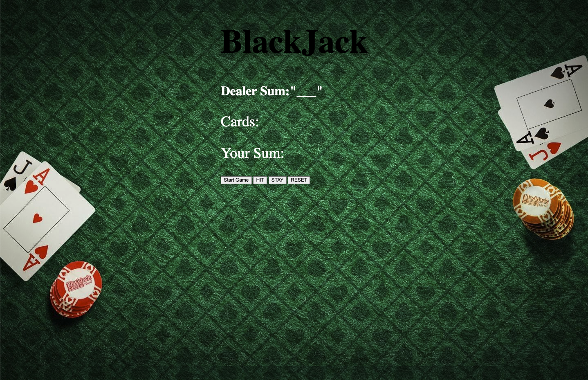

#### [BlackJack](http://fragile-cap.surge.sh)

# BlackJack

## Date: 1/27/2023

### By: Clifton Lucas

#### [GitHub](https://github.com/Cliftonlucas1?tab=repositories) | [LinkedIn]() | [facebook](https://www.linkedin.com/in/clifton-lucas-b80540121/)

---

#### The game objective of the game is to beat the dealer, which can be done in the following ways:

#### Get 21 points on the player's first two cards (called a blackjack), without a dealer blackjack;

#### Reach a final score higher than the dealer without exceeding 21.

#### Let the dealer draw additional cards until his or her hand exceeds 21.

#### The game the player has 1 deck of cards. It has to choose between the four options: Hit, Double Down , The rules for each implementation is described below:\_

#### Hit: Take another card from dealer

#### Stay: Player takes no more cards and dealer draws the card.

#### Rules for the dealer in the game.

#### Dealer hits until his cards total 17 or more points.

#### Dealer also hits on soft 17(i.e, when the dealer initial 2 card value is 17, an initial ace and six).

#### A blackjack beats any hand that is not a blackjack, even one with a value of 21.

#### In the case of a tied score, known as "push" or "standoff", bets are normally returned without adjustment; however, a blackjack beats any hand that is not a blackjack, even one with a value of 21.

### **_Technologies Used_**

- HTML
- Javascript
- CSS

---

### **_Future Updates_**

coming soon!

---

### **_Credits_**

### **_Credits_**

#### background Images: https://wallpaperaccess.com/casino-game

#### Card Pictures: https://github.com/NobodysLackey/card-deck

##### Markdown Cheatsheet: [GitHub](https://guides.github.com/pdfs/markdown-cheatsheet-online.pdf)

---
